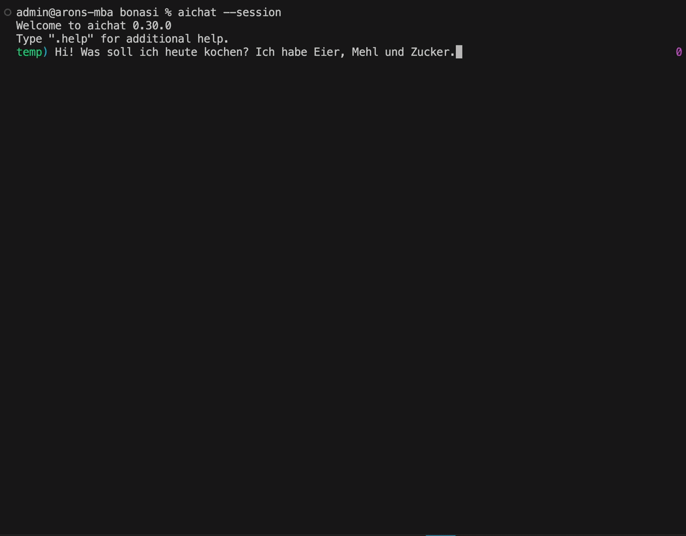

# Bonsai

OpenAI-compatible LLM inference server running [**Bonsai-8B**](https://huggingface.co/prism-ml/Bonsai-8B-mlx-1bit) (1-bit quantized, _based on Qwen3-8B_) on Apple Silicon via [MLX](https://github.com/ml-explore/mlx).

Uses a [PrismML MLX fork](https://github.com/PrismML-Eng/mlx) for 1-bit quantization support. I also fixed some bugs and implemented custom features - this is not yet merged upstream. Feel free to take anything you need.

> A Macbook Air M4 can run the model with good performance (see below) and handle a wide range of tasks, including tool calling and long-context retrieval:



## Requirements

- macOS on Apple Silicon (tested on Macbook Air M4 24GB, macOS 15.7.3 with Metal SDK 26)
- Xcode Metal Toolchain (`setup` installs it automatically)

## Quick start

```sh
make setup   # install uv, venv, deps, download model
make start   # launch server on localhost:8430
make test    # run example queries
make stop    # stop the server
```

## Terminal UI (Chat)

If you want to try the model out without writing code, you can use the built-in terminal UI (you may want to install [brew](https://brew.sh/) first):

```sh
# install aichat via brew
brew install aichat

# run aichat
aichat --session
```

You will be prompted for providing a config. 
Answer like this:

```
> No config file, create a new one? Yes
> API Provider (required): openai-compatible
> Provider Name (required): bonsai
> API Base (required): http://localhost:8430/v1
> API Key (optional): 
? LLMs to include (required):  
> [x] prism-ml/Bonsai-8B-mlx-1bit
```

You should see this:

## Commands

| Command | Description |
|---------|-------------|
| `make setup` | Install everything + download model |
| `make start` | Start the OpenAI-compatible server |
| `make stop` | Stop the server |
| `make status` | Check if the server is running |
| `make log` | Tail server logs |
| `make test` | Run example queries (health, chat, streaming) |
| `make bench` | Run 50 varied prompts and report tok/s |
| `make clean` | Remove venv, logs, and caches |

## API

The server exposes the standard OpenAI API at `http://127.0.0.1:8430`:

```sh
curl http://localhost:8430/v1/chat/completions \
  -H "Content-Type: application/json" \
  -d '{"messages": [{"role": "user", "content": "Hello!"}], "max_tokens": 128}'
```

Endpoints:
- `GET  /v1/models` - list available models
- `POST /v1/chat/completions` - chat completion (supports `"stream": true`)


## Per Request Hyperparameters

Just send them as part of the JSON body in the `POST /v1/chat/completions` request.

For example (max predictability):

```json
{
  "messages": [{"role": "user", "content": "Hello!"}],
  "max_tokens": 128,
  "temperature": 0.01,
  "seed": 42
}
```

| Parameter | Default | Description |
|-----------|---------|-------------|
| `max_tokens` | `512` | Maximum number of tokens to generate |
| `temperature` | `0.5` | Sampling temperature (`0.0` = greedy/deterministic, higher = more "creative") |
| `top_p` | `0.85` | Nucleus sampling cutoff (lower = narrower vocabulary) |
| `seed` | - | Random seed for reproducible output |
| `stream` | `false` | Stream response as SSE events |

## Server Configuration

Edit variables at the top of the `Makefile`:

| Variable | Default | Description |
|----------|---------|-------------|
| `PORT` | `8430` | Server port |
| `MODEL` | `prism-ml/Bonsai-8B-mlx-1bit` | HuggingFace model ID |

## Integrations

Both examples use the standard OpenAI function calling API against the running server.

### Python

[test_tools.py](test_tools.py) - zero-dependency (stdlib `urllib` only) integration test.

```sh
make start
python test_tools.py        # or: make test (runs all suites)
```

Covers single tool calls (`get_weather`, `calculate`) and multi-step tool use (two tools in one conversation).

### Node.js / TypeScript

[test_tools.ts](test_tools.ts) - TypeScript integration test, executed via `bun` / `tsx`.

```sh
make start
pnpx/bunx/npx tsx test_tools.ts      # or: make test (runs all suites)
```

Same scenarios as the Python suite: weather query, math query, and multi-step tool calling.

> Both suites are run automatically by `make test`.

## About this model

| Config | Value | Consequence |
|----------|---------|-------------|
| RoPE (Yarn) | `4x` | RoPE scaling factor (`4x` for 16k x 4 context = 64k by default in model config). Max context window is 64k. |
| Thinking/Reasoning | - | This isn't a reasoning model. |
| Architecture | Dense | This model is based on Qwen3-8B (dense). |
| Tool Calling | Supported | The model can call tools via the OpenAI function calling API. Also multi-step tool calls are supported (parallel). |


### What the model does well

Despite being 1-bit quantized, Bonsai-8B handles a wide range of tasks (`make test` passes 18/18 tests + 6/6 tool-calling tests):

- **Concept explanations** - clear, structured answers (e.g. quantum computing with proper use of bold, headings, and analogies)
- **Factual Q&A** - short, accurate responses to direct questions ("The capital of France is Paris.")
- **Creative writing** - haiku, limericks, and freeform poetry with reasonable quality
- **System prompt adherence** - follows system-role instructions correctly
- **Code-related questions** - understands programming topics (Fibonacci, Python)
- **Tool calling** - single and parallel function calls via the OpenAI API; correctly emits `finish_reason: tool_calls` and valid JSON arguments
- **Streaming** - proper SSE streaming with `[DONE]` sentinel
- **Sampling controls** - `temperature`, `top_p`, and `seed` all work as expected; `seed` + low temp produces deterministic output across runs
- **Long context** - needle-in-a-haystack retrieval at ~4.7k prompt tokens and coherent summarization of long multi-topic transcripts

## License

MIT (for my code, for 3rd party code in `./mlx` see their respective licenses)